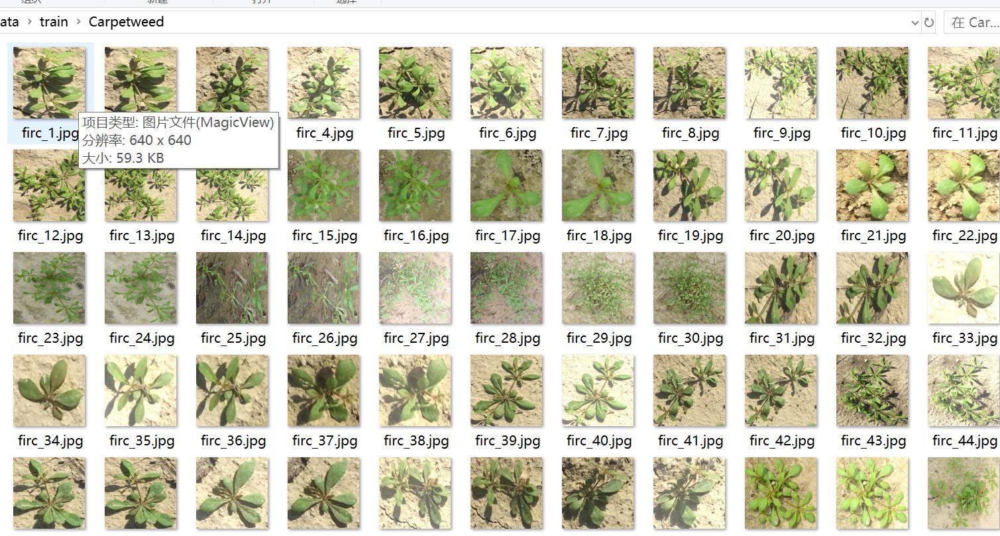
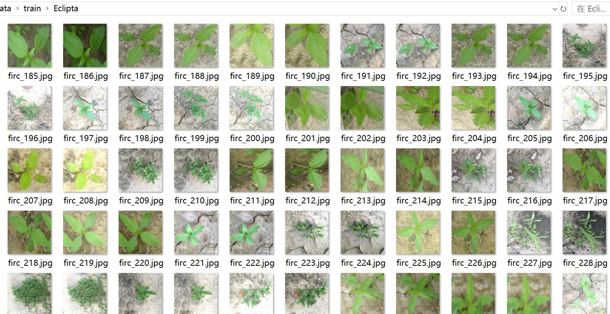
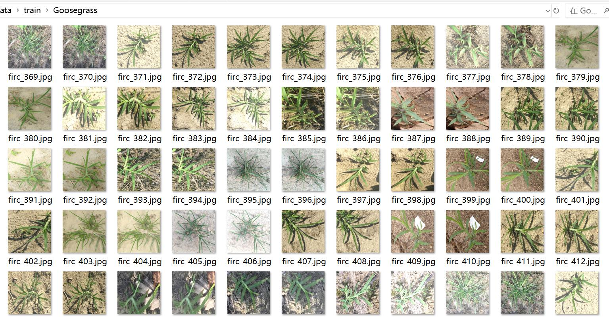
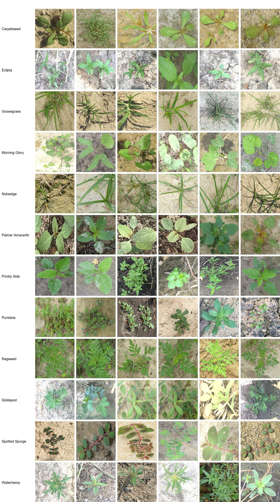

# Weed Classification Dataset with 2652 Images and 12 Categories

The dataset type is for image classification, not for object detection with no annotation file.
The dataset format only contains jpg images, and each classfile folder contains the corresponding image.
number of images: 2652  
number of classes: 12  
category names:['Carpetweed','Eclipta','Goosegrass','Morning Glory','Nutsedge','Palmer Amaranth','Prickly Side','Purslane','Ragweed','Sicklepod','Spotted Spurge','Waterhemp']  
images per class:   
training set image count: 2208  
training set image count: 184  
- Carpetweedtraining set image count: 184
- Ecliptatraining set image count: 184
- Goosegrasstraining set image count: 184
- Morning Glorytraining set image count: 184
- Nutsedgetraining set image count: 184
- Palmer Amaranthtraining set image count: 184
- Prickly Sidetraining set image count: 184
- Purslanetraining set image count: 184
- Ragweedtraining set image count: 184
- Sicklepodtraining set image count: 184
- Spotted Spurgetraining set image count: 184
- Waterhemptraining set image count: 184
validation set image count: 144  
- Carpetweed validation set image count: 12  
- Eclipta validation set image count: 12  
- Goosegrass validation set image count: 12  
- Morning Glory validation set image count: 12  
- Nutsedge validation set image count: 12  
- Palmer Amaranth validation set image count: 12  
- Prickly Side validation set image count: 12  
- Purslane validation set image count: 12  
- Ragweed validation set image count: 12  
- Sicklepod validation set image count: 12  
- Spotted Spurge validation set image count: 12  
- Waterhemp validation set image count: 12
test set image count: 300  
Carpetweed (Carpetgrass) Test Set Image Count: 25
Eclipta (Silver Queen Lily) Test Set Image Count: 25
Goosegrass (Buckwheat Grass) Test Set Image Count: 25
Morning Glory (Ipomoea Flower) Test Set Image Count: 25
Nutmeg (Cannabis/Hempseed) Test Set Image Count: 25
Palmer Amaranth (Palmer Squash) Test Set Image Count: 25
Prickly Side (Aspiranta) Test Set Image Count: 25
Purslane (Portulaca Triloba) Test Set Image Count: 25
Ragweed (Ragweed) Test Set Image Count: 25
Sicklepod (Thistle/Silver Thistle) Test Set Image Count: 25
Spotted Spurge (Malvastrum) Test Set Image Count: 25
Waterhemp (Amaranth/Amaranthus) Test Set Image Count: 25
total images:   
- Carpetweed (Carpet grass) total image count: 221
- Ecliptatotal image count: 221
- Goosegrass (Bouteloua spp.) total image count: 221
- Morning Glory (Morning glory)
- Nettle (Nutgrass) total image count: 221
Palmer Amaranth, also known as Palmer's Amaranth, is a plant species native to the American Southwest and has been cultivated for its nutritional value. It is commonly used in salads, soups, and stews due to its high protein content and low-calorie properties. The total number of images related to Palmer Amaranth is 221.
Prickly Side is a species of plant known for its thorns. It is commonly found in desert regions and can be used as food or medicine. The total image count for Prickly Side is 221.
Purslane, also known as Portulaca oleracea or common purslane, is a plant that belongs to the Portulacaceae family. It has been used for medicinal and culinary purposes for centuries. Purslane is native to Europe, Asia, and North America. The leaves of this plant are green and have a slightly bitter taste. The flowers are white and small, and the fruit is a round, hairy seed pod. Purslane can be grown in many different environments, including dry gardens, greenhouses, and even indoor spaces.
- Ragweed total image count: 221
Sicklepod is a plant that grows in the United States and Canada. It has long, pointed leaves and white flowers that grow in clusters. The plant's root system can be up to 30 feet deep, making it difficult to pull out of the ground. Sicklepod can cause damage to lawns, gardens, and roadsides.
Spotted Spurge (also known as Spotted Seaweed or Spotted Sea-Ivy) is a plant species that belongs to the family Euphorbiaceae. It is native to tropical regions of Asia, including parts of China, India, and Southeast Asia. The leaves have a rosette shape with white spots on them. This plant is often used in traditional medicine for its medicinal properties.
Waterhemp (also known as amaranth or amaranth) is an annual plant that belongs to the Asteraceae family. It is native to tropical and subtropical regions of the world, including North America, South America, Africa, Asia, and Australia. Waterhemp can be found in many different parts of the country, including fields, pastures, and wastelands.

Waterhemp has been used for centuries in various cultures as a source of food, medicine, and fiber. In some areas, it is grown as a cash crop, while in others it is considered a weed. The leaves of waterhemp are rich in protein, vitamins, and minerals, making it a valuable source of nutrition for humans and animals alike.

Waterhemp seeds are also used as a source of oil, which is used in cooking and cosmetic products. The oil is extracted from the seeds by crushing them and pressing them through a sieve. Waterhemp oil is known for its high omega-3 fatty acid content, which makes it a popular alternative to other types of oils.

In addition to its nutritional value, waterhemp is also known for its medicinal properties. It is believed to have anti-inflammatory, anti-bacterial, and anti-fungal properties. In traditional medicine, waterhemp is used to treat a variety of ailments, including digestive issues, skin conditions, and respiratory problems.

Despite its many benefits, waterhemp is not without controversy. Some people argue that it is a weed that should be eliminated from agricultural fields to prevent soil degradation and nutrient depletion. Others believe that waterhemp is a natural part of the ecosystem and should be protected and studied further.

Overall, waterhemp is a fascinating plant with a rich history and diverse uses. Whether you choose to eat it, use its oil for cooking or cosmetics, or study its medicinal properties, there is something special about this plant that will capture your interest.
Important Notes: There are currently no notes.
Special Statement: This dataset does not guarantee the accuracy of the trained model or weight files.
image preview:
## Images

Here is a pay link on Stripe ( https://buy.stripe.com/3cs8yP7sY87d0vu9AB ). Please contact me lonlonago@foxmail.com after funding $89, and I will send you a complete data files , thank you!

